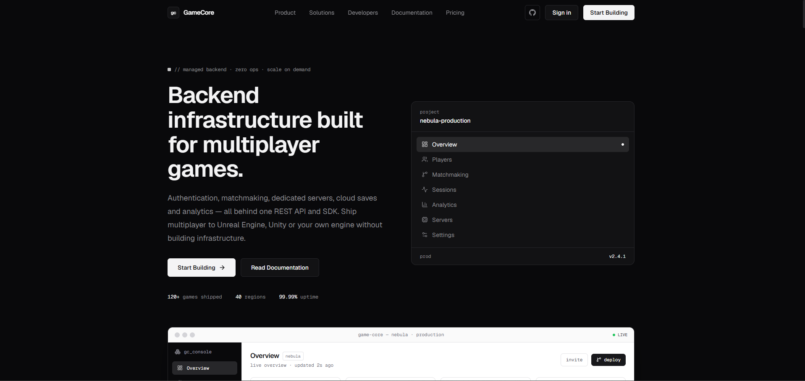

# GameCore



Landing page pour **GameCore**, une plateforme de backend infonuagique pour jeux multijoueurs : authentification, matchmaking, serveurs dédiés, sauvegardes cloud, analytics, etc.

Page d'accueil responsive orientée développeurs, conçue pour les équipes utilisant **Unreal Engine**, **Unity** ou des moteurs personnalisés.

## Stack

- [Next.js](https://nextjs.org) 16 (App Router)
- [React](https://react.dev) 19
- [TypeScript](https://www.typescriptlang.org)
- [Tailwind CSS](https://tailwindcss.com) v4
- [lucide-react](https://lucide.dev) — icônes
- [framer-motion](https://www.framer.com/motion/) — animations

## Fonctionnalités

La page est composée des sections suivantes :

| Section | Description |
| --- | --- |
| Navbar | Navigation fixe avec menu mobile, CTA et icône GitHub |
| Hero | Titre, description, CTA et maquette de dashboard développeur (stats, graphique, file d'attente de matchmaking, journal d'activité) |
| Core Services | 10 services : authentification, profils, matchmaking, classements, succès, statistiques, sauvegardes cloud, inventaire, amis, sessions multijoueur |
| Game Dashboard | Indicateurs animés : joueurs actifs, sessions simultanées, requêtes API, latence moyenne |
| Matchmaking | Flux visuel Player → Queue → Matchmaking → Game Session avec journal terminal |
| Player Management | Tableau de joueurs : nom d'utilisateur, ID, plateforme, niveau, dernière connexion |
| Multiplayer Servers | Tableau des serveurs : région, serveur, joueurs, ping, statut |
| SDK | Onglets interactifs pour Unreal Engine, Unity, C++, C#, TypeScript |
| API | Exemple de requête REST + liste d'endpoints |
| Analytics | Indicateurs DAU / joueurs simultanés / durée de session / rétention avec sparklines |
| Global Infrastructure | Schéma réseau (control plane + régions) et liste de latence par région |
| Security | Authentification, rate limiting, chiffrement, validation serveur |
| Pricing | 3 plans : Indie, Studio, Enterprise |
| Docs CTA | Bandeau d'appel à l'action avec exemple d'installation |
| Footer | Liens, statut des systèmes et colonnes de navigation |

## Prérequis

- Node.js **20** ou plus récent
- npm (ou pnpm / yarn / bun)

## Installation

```bash
# 1. Cloner le dépôt
git clone https://github.com/neylorxt/game-core.git
cd game-core

# 2. Installer les dépendances
npm install

# 3. Lancer le serveur de développement
npm run dev
```

Ouvrir [http://localhost:3000](http://localhost:3000) dans le navigateur.

## Scripts

| Commande | Description |
| --- | --- |
| `npm run dev` | Serveur de développement avec rechargement à chaud |
| `npm run build` | Build de production |
| `npm start` | Lance le serveur de production après `build` |
| `npm run lint` | Vérification ESLint |

## Structure du projet

```
app/
├── layout.tsx            # Layout racine + polices Geist
├── page.tsx              # Composition des sections
├── globals.css           # Thème Tailwind v4
└── components/
    ├── navbar.tsx        # Barre de navigation
    ├── hero.tsx          # Section hero + dashboard mock
    ├── core-services.tsx # Grille des services
    ├── game-dashboard.tsx# Indicateurs + graphique
    ├── matchmaking.tsx   # Flux de matchmaking
    ├── player-management.tsx
    ├── multiplayer-servers.tsx
    ├── sdk.tsx           # Onglets SDK interactifs
    ├── api.tsx           # Exemple d'API REST
    ├── analytics.tsx     # Analytics + rétention
    ├── global-infrastructure.tsx
    ├── security.tsx
    ├── pricing.tsx
    ├── docs-cta.tsx
    ├── footer.tsx
    ├── primitives.tsx    # Reveal, Counter, SectionHeading…
    ├── chart-utils.ts    # Helpers SVG pour les graphiques
    └── icons.tsx         # Icônes partagées (GitHub)
```

## Remarque sur les animations

Les animations au défilement (`Reveal`) et les compteurs animés (`Counter`) reposent sur un hook maison basé sur `IntersectionObserver` natif. Sur certains runtimes React 19, `whileInView` / `useInView` de framer-motion ne se déclenchent pas ; ce hook garantit un comportement fiable.

## Déploiement

Le plus simple est de déployer sur [Vercel](https://vercel.com/new) en connectant le dépôt GitHub. Consultez la [documentation de déploiement Next.js](https://nextjs.org/docs/app/building-your-application/deploying) pour plus de détails.
